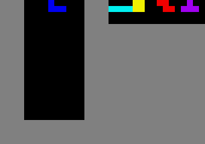

# Tetris-rl-dqn

RL agents for Tetris using `tetris_gymnasium`, trained with **DQN + macro (placement) actions**.

Each "timestep" = 1 placed piece: the agent picks `(rotation, x, hold?)`, the wrapper teleports the piece and hard-drops it.


## Setup (Windows)
```powershell
python -m venv .venv
.\.venv\Scripts\Activate.ps1
pip install -r requirements.txt
```
## Play (simple)
Plays the latest checkpoint in `models/` and auto-detects obs/hold/next-n/reward from the filename:
```powershell
python .\play_bot.py
```
Override with flags if needed.

Use a specific checkpoint or override settings:
```powershell
python .\play_bot.py --model-path .\models\<checkpoint>.zip --obs board --hold-actions --next-n 1 --reward-profile tetris
```

## Train (local)
```powershell
python .\dqn\train_dqn_server.py --timesteps 500000
```

With hold actions + next-5 lookahead:
```powershell
python .\dqn\train_dqn_server.py --timesteps 500000 --obs board --hold-actions --next-n 5 --reward-profile tetris
```

## Resume training
```powershell
python .\dqn\train_dqn_server.py --timesteps 2000000 --resume-from .\models\<checkpoint>.zip
```

## Train on server (headless)
```powershell
ssh root@65.109.128.235 "cd /root/tetris-rl-dqn; OMP_NUM_THREADS=1 MKL_NUM_THREADS=1 OPENBLAS_NUM_THREADS=1 NUMEXPR_NUM_THREADS=1 nohup python train_dqn_server.py --timesteps 2000000 --obs board --hold-actions --next-n 5 --reward-profile tetris > dqn_train.log 2>&1 &"
```

Monitor:
```powershell
ssh root@65.109.128.235 "tail -40 /root/tetris-rl-dqn/dqn_train.log"
```

## Watch the agent play locally
Pull the latest checkpoint from the server and render:
```powershell
.\dqn\peek_dqn.ps1 -Prefix 'dqn_tetris_board_hold' -Obs board -HoldActions 1 -NextN 1 -RewardProfile tetris
```

Or run directly with a local model:
```powershell
python .\dqn\enjoy_local_dqn.py --model-path .\models\<checkpoint>.zip --obs board --hold-actions --next-n 1 --reward-profile tetris --episodes 5 --sleep 0.05
```
## Create a GIF for GitHub
Records a short GIF (default output: `assets/tetris_bot.gif`):
```powershell
python .\record_gif.py --model-path .\models\<checkpoint>.zip --episodes 3 --max-steps 500 --fps 30
```
Auto-detects obs/hold/next-n/reward from the checkpoint filename unless you override them.

Loop forever and keep only the best episode (by lines cleared):
```powershell
python .\record_gif.py --episodes 8 --top-k 1 --select-metric lines --loop 0
```

If your checkpoint was trained without hold actions:
```powershell
python .\record_gif.py --model-path .\models\<checkpoint>.zip --no-hold-actions
```

## Diagnose / evaluate
```powershell
python .\dqn\diagnose_policy_dqn.py --obs board --hold-actions --next-n 1 --reward-profile tetris --n-steps 20000
```

Quick line-clear eval:
```powershell
python .\dqn\eval_lines.py --obs board --hold-actions --next-n 1 --reward-profile tetris --steps 20000
```

## TensorBoard
```powershell
ssh -L 16006:localhost:6006 root@65.109.128.235
# On the server:
tensorboard --logdir /root/tetris-rl-dqn/logs --port 6006 --host 127.0.0.1
```
Then open: http://localhost:16006

## Best models (as of Feb 2025)

- `dqn_tetris_board_hold_32900000` — 75.3 lines/ep (obs=board, hold, next-n=1, tetris reward)
- `dqn_tetris_board_hold_32850000` — 65.0 lines/ep (obs=board, hold, next-n=1, tetris reward)
- `dqn_tetris_board_hold_next5_survival_56000000` — 34.8 lines/ep (obs=board, hold, next-n=5, survival reward)

## Notes
- On PowerShell, avoid `&&` inside remote command strings; use `;` instead.
- For stable server performance, set `OMP_NUM_THREADS=1 MKL_NUM_THREADS=1 OPENBLAS_NUM_THREADS=1 NUMEXPR_NUM_THREADS=1`.
